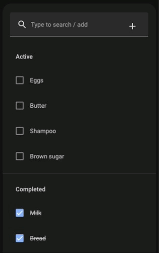
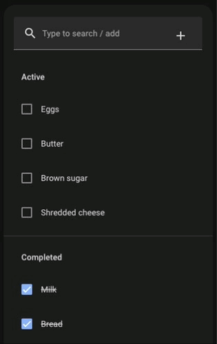
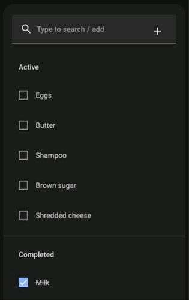

# Searchable List Card

Inspired by [postlund](https://github.com/postlund)'s [search-card](https://github.com/postlund/search-card)

A Todo List card with search capabilities.

This is a very early version, done very quick and dirty.

Please add your improvement suggestions, and feel free to contribute.

### Demo

| Add an item | Find an item | Check / uncheck an item |
|-------------|-------------|-------------|
|  |  | 

## Features

* The Add item textfield now doubles as a search bar
* Helps find existing items and avoid creating duplicates

## Roadmap

Some things I want to add in upcoming releases:

* Add ability to edit / delete items
* Improve performance

## Install

### Simple Install

1. Download `searchable-list-card.js` and copy it into `config/www/searchable-list-card` (create the `searchable-list-card` directory)

2. Add a reference to `searchable-list-card/searchable-list-card.js` inside your `ui-lovelace.yaml`

  ```yaml
  resources:
    - url: /local/searchable-list-card/searchable-list-card.js?v=0
      type: module
  ```

### Git Install

1. Clone this repository into your `www`-directory: `git clone https://github.com/phoenixperson-c137/searchable-list-card`

2. Add a reference to `searchable-list-card/searchable-list-card.js` inside your `ui-lovelace.yaml`

  ```yaml
  resources:
    - url: /local/searchable-list-card/searchable-list-card.js?v=0
      type: module
  ```

<!-- ## HACS

Look for `Searchable List Card` in the store. -->

<!-- ## Updating

If you...

* manually copied the files, just download the latest files and overwrite what you already have
* cloned the repository from Github, just do `git pull` to update

... and increase `?v=X` to `?vX+1`. -->

## Using the card

<!-- ### Options

| Name | Type | Default | Description |
|------|------|---------|-------------|
| max_results | integer | 10 | Max results to show by default
| actions | Object | optional | Custom defined actions
| search_text | String | "Type to search..." | Override of placeholder text
| included_domains | Array of String | optional | Only show entities from defined domains. Cannot be set together with `excluded_domains`.
| excluded_domains | Array of String | optional | Don't show entities from defined domains. Cannot be set together with `included_domains`.

### Actions

You can define custom actions that will call a service (if it exists) with the input. Matching is done via regular expressions and {1}, {2}, {3}, etc. will be replaced by the corresponding group. See example below for inspiration. -->

### Example

  ```yaml
    type: custom:searchable-list-card
    entity: todo.shopping_list
  ```

## Issues and imitations

This is still an early version and may contain bugs. If you find any problems, please write an issue.

## Getting errors?

Clear the browser cache, restart Home Assistant and make sure the configuration is correct.

If you believe you have found an error, please write an issue.
